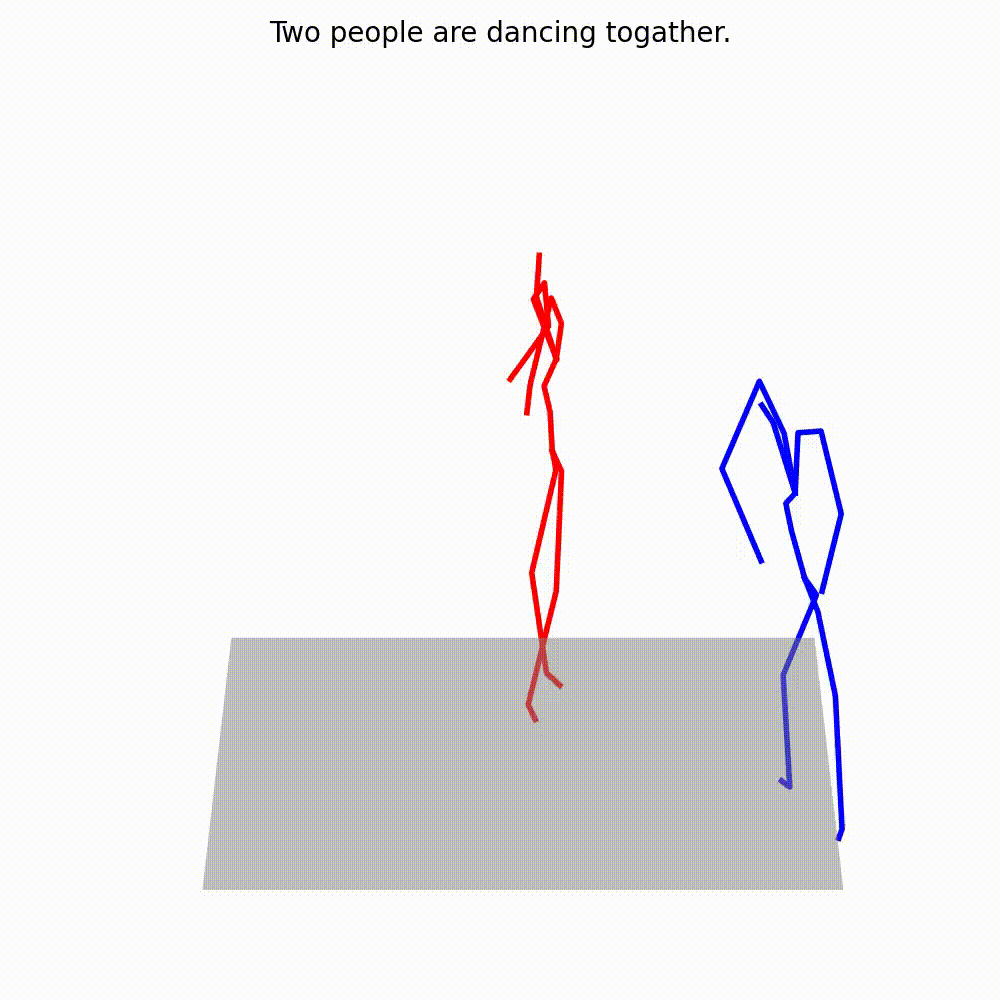

# Text-driven Interactive Motion Generation

<!-- TOC -->
This project is to generate the motion of two people interaction in terms of joints coordinates, according to the text discription. 

## Environment

This project should be run on a pytorch environment, with cuda.   
To install the necessary package, type this command:  
```shell
pip install -r requirements.txt
```

## Training

To train the model, you should access Interhuman dataset (https://github.com/tr3e/InterGen#interhuman-dataset) at first. Then, put the dataset into data/interhuman folder.

You can train the model with this command:

```shell
PYTHONPATH="$(dirname $0)/..":$PYTHONPATH \
srun -p ${PARTITION} -n8 --gres=gpu:8 -u \
    python -u tools/train.py \
    --name interhuman_bs32 \
    --batch_size 32 \
    --times 1 \
    --num_epochs 50 \
    --dataset_name interhuman \
```


## Evaluation

Prior to the evaluation, you first need to train the evaluation model with the following command:
```shell
python -u tools/train_evaluator.py 
```
Then, run the following command:
```
python -u tools/evaluation.py checkpoints/interhuman/interhuman_bs32/opt.txt
```

## Visualization


```shell

python -u tools/visualization.py \
    --root "checkpoints/interhuman/interhuman_bs32" \
    --text "Two people are dancing together" \
    --motion_length 100 \
    --result_path "test_sample.gif" \
```
Here is an example:  
<td></td>  


## Acknowledgement

This code is developed on top of [MotionDiffuse: Text-Driven Human Motion Generation with Diffusion Model](https://github.com/mingyuan-zhang/MotionDiffuse)